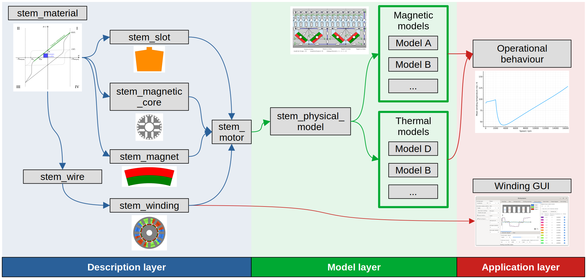

# Introduction

STEM is a **S**imulation **T**oolbox for **E**lectric **M**otors written in
Rust, consisting of multiple crates (packages / libraries) for defining
electric motors, calculation of their properties and simulation of their
operating behaviour. This framework offers a huge variety of features, such as:
- calculate winding factors, resistance, inductance, wire length etc. of
arbitrary windings,
- get the leakage inductances for a wide variety of slot geometries,
- define custom magnetic simulation models or use predefined ones to determine
the torque of a motor,
- simulate the S1 torque characteristic of a motor using coupled magnetic /
thermal models,
- predict the start-up behaviour (maximum currents and torque) of an
asynchronous motor starting at the power grid with different loads,
- create interactive GUIs for winding analysis,
- ... and many more!

The individual crates of the ecosystem are designed to be modular and
extensible. This makes it easy to define your own custom motor components (e.g.
custom magnets), magnetic / thermal models or even optimization routines.

This book is a tutorial / manual for STEM, showcasing how to use it, its general
design philosophy, its components and how to extend it. The API documentation
of the individual crates can be found on [https://docs.rs/]. Where appropriate,
this book provides links to it.

As of now, all the features hinted at above exist, but most of the ecosystem is
not yet uploaded to crates.io due to a lack of documentation (and in practice,
software without good documentation is hardly usable). Over the following
months, I strive to fix this one crate at a time and to upload them individually
to Github and crates.io

## License

Every crate in the framework as well as this book itself is licensed under the
[MIT license](https://opensource.org/license/mit).

## Ecosystem overview

Crates belonging to the ecosystem are prefixed with `stem_` and can be sorted
into three different layers:
- The "description layer" offers the fundamental building blocks for defining
a motor: Its components, its geometry, its materials, its winding design and so
on.
- The "model layer" is centered around the `stem_physical_model` crate
which defines interfaces (traits) for magnetic and thermal models. All other
crates within this layer are based on it and describe a particular magnetic or
thermal model.
- Crates within the "application layer" either provide complex routines for e.g.
the calculation of operational behaviour combining magnetic and thermal models
or form fully self-contained applications such as the `stem_winding_gui` for
interactive evaluation of winding properties.

### Crates belonging to STEM

#### Description layer

#### Model layer

#### Application layer

